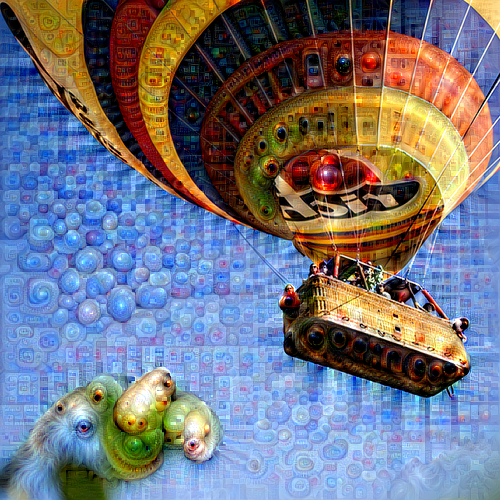

# Pytorch implementation of DeepDream
                                                                               
## Result                                                                                     
| Content             |  Style |
:-------------------------:|:-------------------------: |
  |    |

